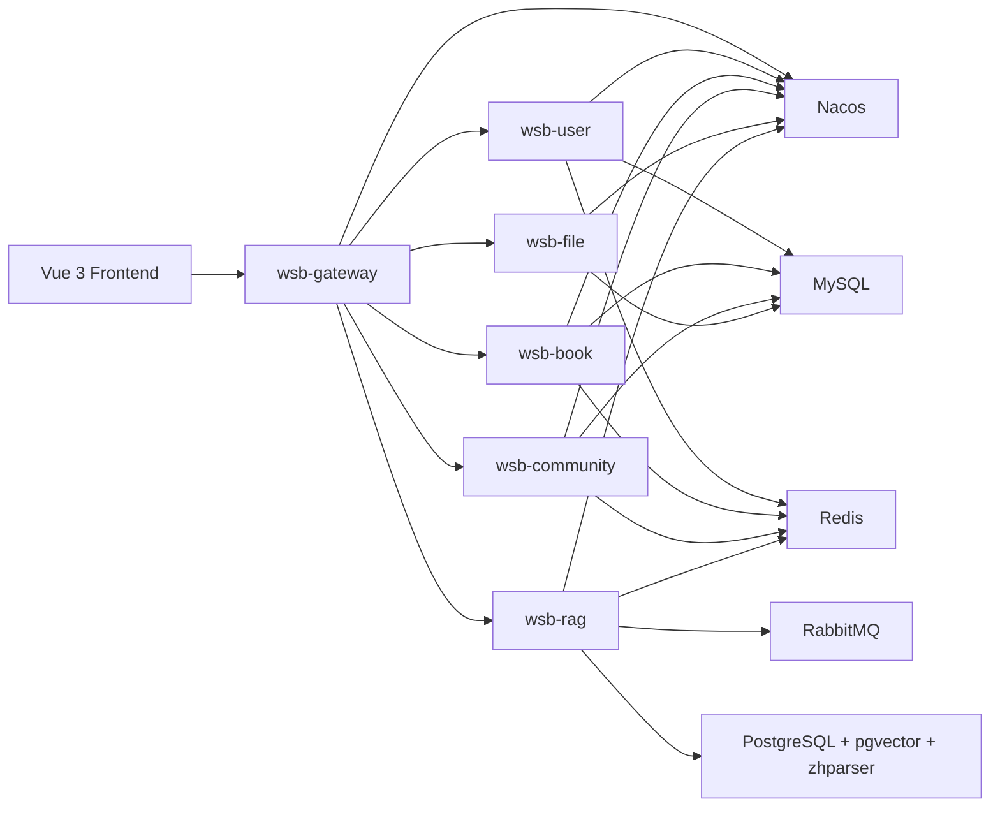

# WSB SmartLibrary

一个面向个人藏书管理、借阅协作、社区分享与 AI 阅读辅助的全栈智能书库项目。

本仓库采用前后端一体的 monorepo 结构：

- 后端：Spring Boot 3 + Spring Cloud Alibaba 微服务
- 前端：Vue 3 + Vite + TypeScript
- AI 检索：Spring AI + PostgreSQL + pgvector + `zhparser`
- 本地依赖：MySQL、Redis、Nacos、RabbitMQ、PostgreSQL

项目目标不是只做“图书录入”，而是把个人书架、群组借阅、统计分析和智能推荐串成一套完整的阅读管理系统。

## 核心能力

- 用户注册、登录、资料维护、短信验证码
- 图书录入、编辑、删除、ISBN 查询、封面上传
- 书架管理、上架下架、阅读记录、借入借出管理
- 图书收藏、群组分享、群成员协作借阅
- 个人统计、借阅统计、收藏统计、排行榜
- AI 摘要、书评聚合、相似图书推荐、自然语言推荐

## 系统架构



## 技术栈

| 层次 | 技术 |
| --- | --- |
| 后端基础 | Java 17, Maven, Spring Boot 3.2.4 |
| 微服务 | Spring Cloud 2023, Spring Cloud Alibaba, OpenFeign, Nacos |
| 数据访问 | MyBatis-Plus, MySQL 8 |
| 权限认证 | Sa-Token |
| 文档 | OpenAPI 3, Knife4j |
| 缓存与消息 | Redis 7, RabbitMQ |
| AI / 检索 | Spring AI, pgvector, PostgreSQL 16, zhparser |
| 前端 | Vue 3, Vite, TypeScript, Pinia, Vue Router, Axios, ECharts |

## 仓库结构

```text
.
├─ frontend/                 # Vue 3 前端
├─ docker/                   # 本地依赖环境与 pgvector 镜像构建
├─ docs/                     # 项目文档
├─ sql/                      # 建表、迁移、RAG 初始化脚本
├─ wsb-gateway/              # 网关服务
├─ wsb-common/               # 公共基础模块
├─ wsb-api/                  # Feign API 契约模块
└─ wsb-modules/              # 业务模块集合
   ├─ wsb-user/              # 用户域
   ├─ wsb-book/              # 图书域
   ├─ wsb-community/         # 社区域
   ├─ wsb-file/              # 文件域
   └─ wsb-rag/               # 智能检索 / AI 推荐域
```

## 模块说明

| 模块 | 说明 |
| --- | --- |
| `wsb-gateway` | 统一入口、路由转发、接口文档聚合 |
| `wsb-user` | 注册登录、用户信息、内部昵称查询 |
| `wsb-book` | 图书、书架、借阅、阅读记录、收藏、ISBN 查询 |
| `wsb-community` | 群组、成员、分享、群借阅申请、统计分析 |
| `wsb-file` | 图片上传与读取 |
| `wsb-rag` | AI 摘要、书评聚合、相似图书、智能推荐 |
| `wsb-api-*` | 各服务间的 DTO / VO / Feign 契约 |
| `wsb-common-*` | 认证、日志、文档、MyBatis、核心工具类 |

更细的业务边界可以查看 [docs/architecture/modules.md](./docs/architecture/modules.md)。

## 前端页面覆盖

当前前端已经覆盖这些主要页面：

- 登录 / 注册
- 首页工作台
- 我的图书
- 图书详情
- 借阅管理
- 我的收藏
- 社区协作
- 数据统计
- 个人中心

前端路由与接口封装位于：

- [frontend/src/router/index.ts](./frontend/src/router/index.ts)
- [frontend/src/api](./frontend/src/api)

## 本地开发环境

### 1. 环境要求

| 组件 | 建议版本 |
| --- | --- |
| JDK | 17 |
| Maven | 3.9+ |
| Node.js | 20+ |
| npm | 10+ |
| Docker Desktop | 最新稳定版 |

### 2. 启动基础依赖

仓库已经提供统一的本地依赖编排文件：

```bash
docker compose -f docker/docker-compose.yml up -d --build
```

默认会启动：

| 服务 | 端口 | 说明 |
| --- | --- | --- |
| MySQL | `3306` | 业务库 + Nacos 配置库 |
| Redis | `6379` | 缓存、会话、短期数据 |
| Nacos | `8848`, `9848` | 注册中心 + 配置中心 |
| RabbitMQ | `5672`, `15672` | RAG 异步任务 |
| PostgreSQL / pgvector | `5432` | 向量存储与中文全文检索 |

说明：

- 当前 `docker/docker-compose.yml` 默认偏向 Win11 本地开发环境。
- 默认数据目录统一使用 `E:/Docker/...`。
- 如果你的磁盘路径不同，可以通过环境变量覆盖：
  - `WSB_MYSQL_DATA_DIR`
  - `WSB_REDIS_DATA_DIR`
  - `WSB_NACOS_INIT_DIR`
  - `WSB_NACOS_LOG_DIR`
  - `WSB_NACOS_DATA_DIR`
  - `WSB_PGVECTOR_DATA_DIR`
  - `WSB_PGVECTOR_INIT_SQL`

Docker 相关说明可查看 [docker/README.md](./docker/README.md)。

### 3. 初始化数据库

MySQL 业务表建议按以下顺序准备：

1. 执行基础结构脚本 [sql/schema/book_schema_alibaba_standard.sql](./sql/schema/book_schema_alibaba_standard.sql)
2. 再执行增量脚本目录 [sql/migrations](./sql/migrations)

RAG 向量库的初始化脚本为：

- [sql/rag/rag_pgvector_init.sql](./sql/rag/rag_pgvector_init.sql)

这份脚本会创建：

- `vector` 扩展
- `zhparser` 扩展
- `public.wsb_zhcfg` 中文分词配置
- `book_embeddings` 向量表与检索索引

注意：

- 该脚本会在 `pgvector` 容器首次初始化数据目录时自动执行。
- 如果 `E:/Docker/pgvector/data` 已经存在历史数据，初始化脚本不会自动重跑，此时需要你手动执行一次。

SQL 目录说明见 [sql/README.md](./sql/README.md)。

### 4. 准备 Nacos 配置

当前各服务的 `application.yml` 只保留了最小引导配置，真正运行时配置从 Nacos 加载。

服务会默认读取：

- `wsb-common.yml`
- `wsb-gateway-dev.yml`
- `wsb-user-dev.yml`
- `wsb-book-dev.yml`
- `wsb-community-dev.yml`
- `wsb-file-dev.yml`
- `wsb-rag-dev.yml`

仓库里已经提供可导入模板，见 [nacos/](./nacos)。

因此本地启动前，需要先在 Nacos 中准备这些 Data ID，对应内容通常包括：

- 服务端口
- MySQL 数据源
- Redis 连接
- RabbitMQ 连接
- 文件存储配置
- Sa-Token 配置
- Spring AI / 大模型 / Embedding 配置
- `rag.pgvector.*` 相关参数

当前本地基础环境中，Nacos 的配置持久化已经约定走 MySQL `nacos_config` 库；而服务注册相关的本地 raft / naming 数据仍会保存在 `E:/Docker/nacos/data`。

### 5. 启动后端服务

推荐在 IntelliJ IDEA 中直接运行以下启动类：

| 模块 | 启动类 |
| --- | --- |
| 网关 | `com.wsb.gateway.GatewayApplication` |
| 用户服务 | `com.wsb.user.UserApplication` |
| 图书服务 | `com.wsb.book.BookApplication` |
| 社区服务 | `com.wsb.community.WsbCommunityApplication` |
| 文件服务 | `com.wsb.file.WsbFileApplication` |
| RAG 服务 | `com.wsb.rag.WsbRagApplication` |

如果只想先验证编译，可以在仓库根目录执行：

```bash
mvn clean compile -DskipTests
```

### 6. 启动前端

```bash
cd frontend
npm install
npm run dev
```

默认访问地址：

- 前端开发服务器：`http://localhost:5173`
- 前端会把 `/api` 代理到：`http://localhost:8080`

前端独立说明见 [frontend/README.md](./frontend/README.md)。

## 接口与联调

项目已经接入 OpenAPI / Knife4j。网关启动后，通常可以通过以下地址查看接口文档：

```text
http://localhost:8080/doc.html
```

如果你在 Nacos 中把网关端口配置成了其他值，请按实际端口访问。

前端主要调用的接口域包括：

- `/v1/admin/*` 用户与认证
- `/v1/book/*` 图书、借阅、阅读记录
- `/v1/bookshelf/*` 书架
- `/v1/collect/*` 收藏
- `/v1/group/*` 群组与群协作
- `/v1/community/statistics/*` 统计分析
- `/v1/rag/*` AI 推荐与摘要能力
- `/v1/picture/*` 图片上传

## RAG 与 AI 能力

`wsb-rag` 目前承担以下能力：

- 图书 AI 摘要生成
- 网络书评聚合
- 相似图书推荐
- 自然语言推荐
- 向量化与混合检索

当前实现特点：

- 向量存储使用 PostgreSQL + pgvector
- 中文全文检索使用 `zhparser`
- 异步任务使用 RabbitMQ
- 向量配置通过 `rag.pgvector.*` 管理
- 当前默认向量维度为 `1024`
- 向量表为 `public.book_embeddings`

和代码对应的关键位置：

- [wsb-modules/wsb-rag/src/main/java/com/wsb/rag/controller/RagController.java](./wsb-modules/wsb-rag/src/main/java/com/wsb/rag/controller/RagController.java)
- [wsb-modules/wsb-rag/src/main/java/com/wsb/rag/config/RagVectorConfig.java](./wsb-modules/wsb-rag/src/main/java/com/wsb/rag/config/RagVectorConfig.java)
- [sql/rag/rag_pgvector_init.sql](./sql/rag/rag_pgvector_init.sql)

## 常用验证命令

后端编译：

```bash
mvn -pl wsb-gateway,wsb-modules/wsb-user,wsb-modules/wsb-book,wsb-modules/wsb-community,wsb-modules/wsb-file,wsb-modules/wsb-rag -am -DskipTests compile
```

前端构建：

```bash
cd frontend
npm run build
```

Docker 配置检查：

```bash
docker compose -f docker/docker-compose.yml config
```

## 当前目录整理约定

- `docker/`：本地依赖环境与自定义镜像构建
- `nacos/`：Nacos 配置模板与导入说明
- `docs/`：仓库级说明文档
- `sql/`：建库、迁移与 RAG 初始化脚本
- `frontend/`：前端应用

## 注意事项

- 这是一个“代码在仓库、运行配置在 Nacos”的项目，直接 `git clone` 后通常还需要补齐本地配置中心内容。
- `docker/docker-compose.yml` 默认目录是我方当前 Win11 开发机路径约定，不同机器请按需覆写环境变量。
- `docker/mysql/init/nacos-mysql-schema.sql` 是 Nacos 官方 MySQL 表结构，空库首次启动时会自动导入。
- `pgvector` 的初始化脚本只会在全新数据目录上自动执行，老数据目录场景请手动补执行。
- 前端默认代理网关地址为 `http://localhost:8080`，如果网关端口有变更，记得同步调整 [frontend/vite.config.ts](./frontend/vite.config.ts)。

## 相关文档

- [docker/README.md](./docker/README.md)
- [nacos/README.md](./nacos/README.md)
- [docs/README.md](./docs/README.md)
- [docs/architecture/modules.md](./docs/architecture/modules.md)
- [sql/README.md](./sql/README.md)
- [frontend/README.md](./frontend/README.md)
